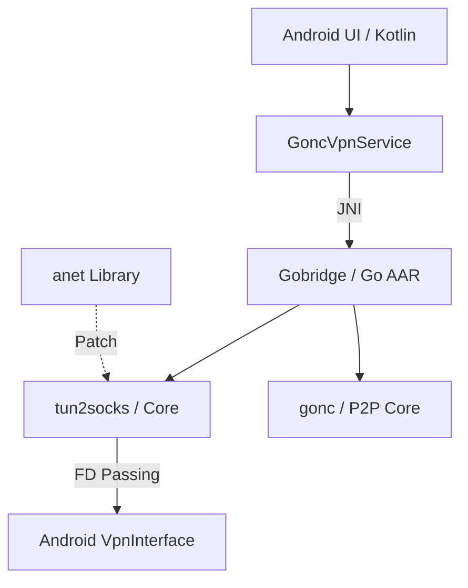

# Gonc VPN for Android

[](https://opensource.org/licenses/MIT)
[](https://golang.org)
[](https://developer.android.com)

Gonc VPN 是一款基于 Go 语言核心开发的 Android P2P VPN 客户端。它通过集成 `gonc` 和 `tun2socks` 核心，利用 Android `VpnService` 实现了高性能、低延迟的私有网络加密访问。

本项目解决了 Go 语言网络栈在 Android 平台上的多个痛点，包括 **Android 11+ 无法获取 MAC 地址导致的崩溃** 以及 **Go 底层 `os.Exit` 导致的进程稳定性问题**。

---

## ✨ 核心特性

*   **高性能 P2P 通讯**：基于 `gonc` (v2) 协议，实现端对端的加密隧道。
*   **Android 11+ 原生兼容**：集成特殊的 `anet` 补丁库，通过 Netlink `RTM_GETADDR` 绕过系统对网卡信息的封锁，保证在最新 Android 系统上稳定发现网络接口。
*   **工业级稳定性**：
    *   重写了 Go 核心的退出逻辑，将 `os.Exit` 替换为 `panic/recover`。
    *   即使 Go 逻辑发生严重错误，Android 宿主进程也不会被强杀，VPN 服务可优雅降级或重启。
*   **全协议支持**：完美支持 **IPv4 & IPv6** 全局代理。
*   **JNI 桥接架构**：使用 `gomobile` 将 Go 核心封装为 AAR 库，通过原生内存访问传递文件描述符（FD），比运行二进制文件的方案更安全、更高效。
*   **网络优化**：预设 1400 MTU，针对移动网络环境进行了包分片优化。

---

## 🛠️ 技术架构

项目采用了清晰的分层设计：



---

## 🚀 快速开始

### 编译流程

由于本项目包含复杂的 Git 子模块依赖，请务必使用递归克隆：

1.  **拉取源码**:
    ```bash
    git clone --recursive https://github.com/ttdxq/gonc_vpn_on_android.git
    ```

2.  **编译 Go AAR 库**:
    确保已安装 `gomobile` 并配置了 `ANDROID_HOME`。
    ```powershell
    # 运行编译脚本
    ./build_binaries.ps1
    ```

3.  **编译 Android APK**:
    在 Android Studio 中打开项目，或者直接运行：
    ```powershell
    ./gradlew assembleDebug
    ```

### 使用指南

1.  启动 App。
2.  输入您的 **P2P Secret Key**。
3.  配置需要代理的 **CIDR 路由**（例如 `0.0.0.0/0` 为全局代理，`::/0` 为全局 IPv6）。
4.  点击 **Start VPN** 按钮，授予系統 VPN 权限。

---

## 📜 开源协议与声明

*   **主项目**: [MIT License](LICENSE)
*   **核心依赖**:
    *   [gonc](https://github.com/threatexpert/gonc) (MIT) - 稳定性增强版
    *   [tun2socks](https://github.com/xjasonlyu/tun2socks) (MIT)
    *   [anet](https://github.com/wlynxg/anet) (BSD 3-Clause) - Android 11+ 兼容补丁版

详细声明请参见 [NOTICE](NOTICE) 文件。

---

## 🤝 贡献与反馈

欢迎提交 Issue 和 Pull Request！我们特别欢迎针对 P2P 连接效率、UI/UX 改进以及多平台兼容性的建议。

---
*Created by [ttdxq](https://github.com/ttdxq)*
